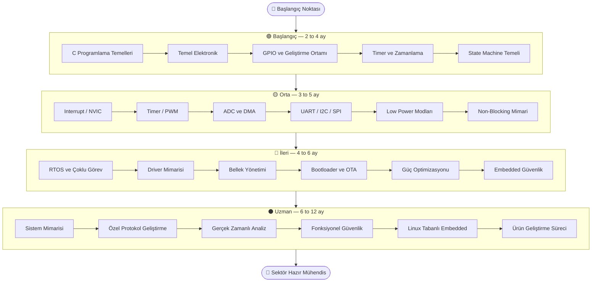

# embeddedTR Roadmap 🇹🇷

🇹🇷 Türkçe | 🇬🇧 [English](./README.en.md)

Gömülü sistem mühendisliği öğrenmek isteyenler için seviyelere ayrılmış kapsamlı bir yol haritası.

---

## Öğrenme Yolu

---

## Seviyeler

| Seviye | Süre | Hedef Kitle |
|---|---|---|
| [🟢 Başlangıç](./roadmap/beginner.md) | 2–4 ay | Hiç gömülü deneyimi olmayanlar |
| [🟡 Orta](./roadmap/intermediate.md) | 3–5 ay | GPIO ve C temelini bilenler |
| [🔴 İleri](./roadmap/advanced.md) | 4–6 ay | Peripheral'larla çalışabilenler |
| [⚫ Uzman](./roadmap/expert.md) | 6–12 ay | Üretim deneyimi kazananlar |

---

## Proje Hedefleri

- 🇹🇷 Türkiye'de embedded için referans kaynak oluşturmak
- 📐 Öğrenme sürecini sistematik hale getirmek
- 🔧 Pratik mühendislik yetkinliklerini ön plana çıkarmak

---

## Katkıda Bulun

Eksik gördüğün konu, yanlış bilgi veya kaynak önerisi için PR aç ya da issue oluştur.

Her katkı topluluğu güçlendirir. 🙌

➡️ [embeddedTR Ana Sayfa](https://github.com/embeddedTR)
